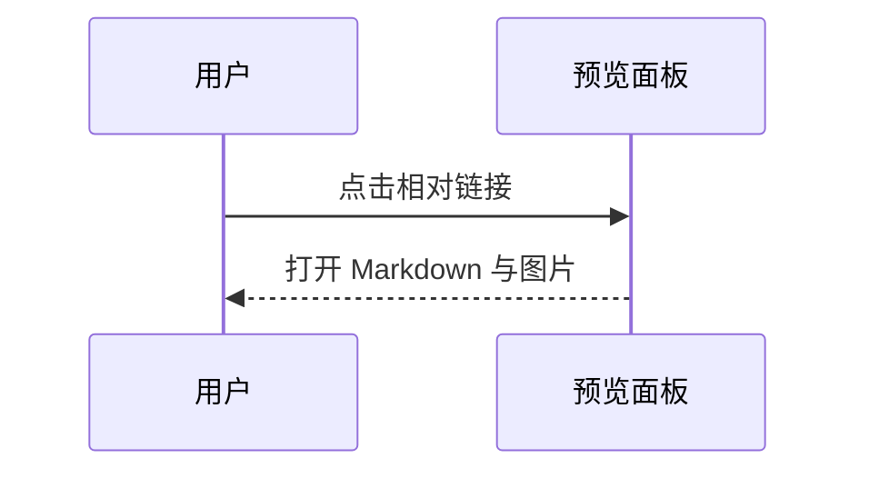

# 链接目标文档

[跳转到详细说明](#详细说明)

[返回演示文档](../math-demo.md#mermaid-图表)

## 相对图片

此图片以当前 guide/details.md 所在目录为基准：

## 详细说明

链接到本文的 `#详细说明` 会直接定位到这里。公式仍可用：$a^2+b^2=c^2$。

```mermaid
sequenceDiagram
    participant User as 用户
    participant Preview as 预览面板
    User->>Preview: 点击相对链接
    Preview-->>User: 打开 Markdown 与图片
```
